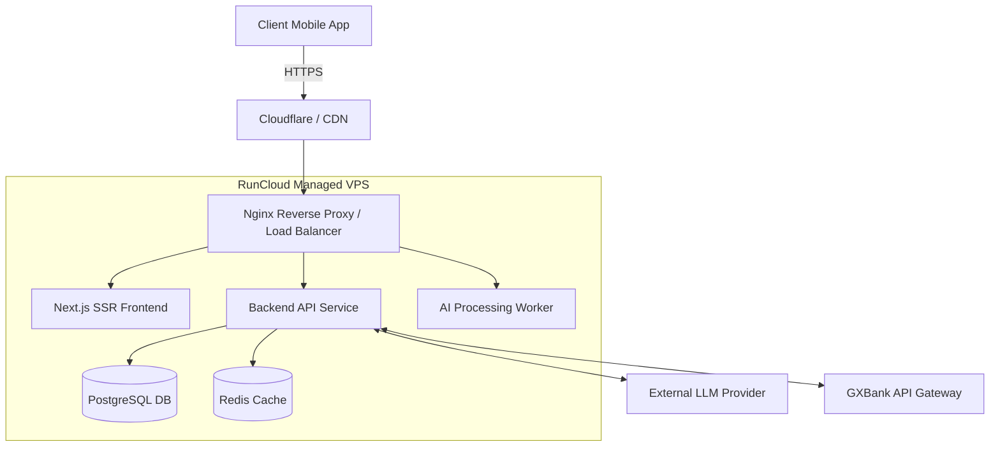

# GX Youth — Future System Architecture (Roadmap)

> **Vision:** Transitioning from a static, in-memory PWA prototype to a production-ready, AI-driven financial ecosystem utilizing real-time banking APIs and cloud-native infrastructure.

## 1. High-Level Future Architecture

The future architecture introduces a robust backend layer, persistent data storage, and genuine AI model integration to replace current client-side simulations.

```
┌─────────────────┐       ┌─────────────────┐       ┌─────────────────┐
│                 │       │                 │       │   GXBank API    │
│  GX Youth PWA   │◄─────►│ Backend Gateway │◄─────►│  (Open Banking) │
│ (Next.js Client)│  HTTPS│ (Node/FastAPI)  │  mTLS │                 │
│                 │       │                 │       └─────────────────┘
└────────┬────────┘       └────────┬────────┘
         │                         │
         │ WebSockets              ├──► PostgreSQL (User Data & Transactions)
         │ (Real-time Insights)    ├──► Redis (Caching & Session State)
         ▼                         └──► LLM Integration Service
 ┌───────────────┐                      (OpenAI / Local Hosted Models)
 │ Firebase Push │
 │ Notifications │
 └───────────────┘
```

## 2. Core Upgrades from Current System

### A. Real-Time Data & Persistence
- **Current:** Zustand in-memory state (lost on refresh).
- **Future:** 
  - **PostgreSQL** for ACID-compliant storage of user profiles, transaction history, and savings pockets.
  - **Prisma or Drizzle ORM** for type-safe database access.
  - **GXBank API Integration:** Automatically sync live transaction data via Open Banking standards instead of manual QR scan simulations.

### B. Genuine AI "GX Buddy" Integration
- **Current:** Hardcoded timeout simulations.
- **Future:**
  - Dedicated **AI Orchestrator Service** built with Python (LangChain/LlamaIndex).
  - **Retrieval-Augmented Generation (RAG):** AI accesses a user's specific financial history securely to provide contextual advice.
  - **Multi-Agent System:** Real implementation of the Council (Savings Sentinel, Debt Shield, Finance Strategist) using specialized prompt chains and fine-tuned lightweight models.

### C. Authentication & Security
- **Current:** No authentication; hardcoded mock user.
- **Future:**
  - **OAuth 2.0 / OIDC** integration (potentially allowing users to log in directly with their GXBank credentials).
  - **JWT** (JSON Web Tokens) for stateless API session management.
  - Encrypted storage for sensitive financial data.

## 3. Deployment & Cloud Infrastructure (Sponsored by RunCloud)

Moving away from GitHub Pages static hosting to a fully managed cloud server environment:



- **RunCloud Management:** Utilize RunCloud to manage VPS provisioning, SSL certificates, and zero-downtime deployments.
- **Dockerization:** Containerize the Next.js frontend, backend API, and worker processes for seamless scaling.

## 4. Advanced Features Enabled by Future Architecture

| Feature | Implementation Path |
|---|---|
| **Predictive Cashflow Modeling** | Backend cron jobs run machine learning models over historical PostgreSQL data to predict "broke dates" with high accuracy. |
| **Marketplace API Integration** | The Finance Strategist actively fetches live pricing from Shopee/Lazada Open APIs instead of relying on hardcoded arrays. |
| **Push Notifications** | Service Workers + Firebase Cloud Messaging (FCM) to send urgent "Debt Shield" alerts even when the app is closed. |
| **Shared Pockets (Social)** | Database relationships allow multiple users to contribute to a shared "Savings Pocket" (e.g., a trip with friends). |

## 5. Proposed Tech Stack

*   **Frontend:** Next.js (Server-Side Rendering + Client Components), Tailwind CSS, Framer Motion, Zustand (for UI state).
*   **Backend:** Node.js (NestJS or Express) OR Python (FastAPI for native AI integration).
*   **Database:** PostgreSQL.
*   **Cache / Message Queue:** Redis (handling WebSockets and background AI task queues).
*   **AI Engine:** OpenAI API or self-hosted LLM (e.g., Llama 3) for the GX Buddy logic.
*   **DevOps:** RunCloud, Docker, GitHub Actions CI/CD.
